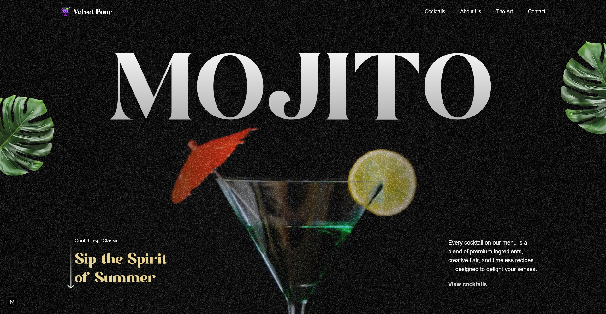

### Mojito: The Spirit of Summer Cocktails

A modern web experience showcasing a curated selection of cocktails, blending premium ingredients, creative flair, and timeless recipes. This project highlights a passion for mixology through a visually stunning and performant digital interface.

---

## 📸 Screenshot

Here's a glimpse of the Mojito landing page:



---

## 🚀 Technologies Used

- **Next.js**: React framework for production.
- **Tailwind CSS (v4+)**: Utility-first CSS framework.
- **GSAP**: Professional-grade JavaScript animation library.

---

## ✨ Key Features

- **Interactive Hero Section:** A dynamic video background with scroll-based animations.
- **Fluid Typography:** Captivating text effects using GSAP's SplitText plugin.
- **Scroll-Driven Animations:** Elements are animated into view using GSAP's ScrollTrigger.
- **Responsive Design:** Optimized for a seamless experience across all devices.

---

## Getting Started

First, run the development server:

```bash
npm run dev
# or
yarn dev
# or
pnpm dev
# or
bun dev
```

Open [http://localhost:3000](http://localhost:3000) with your browser to see the result.

You can start editing the page by modifying `app/page.tsx`. The page auto-updates as you edit the file.

### 📚 Learning & Acknowledgments

This project is a direct result of the incredible learning resources provided by **jsmastery.pro** and **Adrian Hajdin ([@adrianhajdin](https://github.com/adrianhajdin))**.

Completed as part of an online course to deepen my understanding of GSAP. Key concepts learned include:

- Imperative vs. Declarative Animation: Integrating imperative GSAP animations with React's declarative nature using the useGSAP hook.

- Pinning and Scrubbing: Creating scroll-based animations where element movement is directly tied to the scroll position.

- Advanced Text Effects: Using GSAP's SplitText to create complex character and word-level animations.
